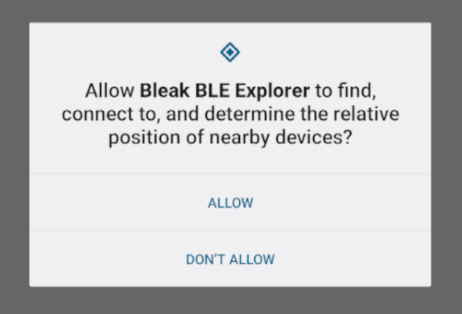

Android backend (BeeWare)
=========================

This backend is intended for Android apps using the `BeeWare <https://beeware.org/>`_ toolchain:

`Briefcase <https://briefcase.readthedocs.io/en/latest/>`_ is used to build the application. 
Under the hood, it uses `Chaquopy <https://chaquo.com/chaquopy/>`_ to package the Python 
application into an Android app and to bind to the Android Java APIs. Additionally, a GUI 
using the `Toga <https://toga.readthedocs.io/en/latest/>`_ library is required for requesting 
Bluetooth permissions.
 
The BeeWare backend classes are located in the ``bleak.backends.android`` package and are 
automatically selected when the application is built with Briefcase.

This backend requires Python 3.13 or later, as Android is only officially supported since that
version (see `PEP 738 <https://peps.python.org/pep-0738/>`_) and only since then can an Android
environment be reliably detected via ``sys.platform == "android"`` at runtime or via
`environment markers <https://peps.python.org/pep-0508/#environment-markers>`_
(``sys_platform == "android"``) for dependency resolution.

Briefcase Configuration
-----------------------

To use Bluetooth functionality in an application built with Briefcase, some settings must be 
configured in the ``pyproject.toml`` file.

Static proxies must be defined so that Java callbacks from Android can be forwarded to the 
Python implementations in Bleak:

.. code-block:: toml

    build_gradle_extra_content = """
    android.defaultConfig.python.staticProxy(
        'bleak.backends.android.scanner_callback',
        'bleak.backends.android.client_callback',
        'bleak.backends.android.broadcast'
    )
    """

Additionally, the required Bluetooth permissions must be added. Briefcase has an option
to add `Bluetooth permissions <https://briefcase.beeware.org/en/stable/reference/configuration/#permissionbluetooth>`_
to the app (available since Briefcase v0.3.26):

.. code-block:: toml

    permission.bluetooth = "This app uses Bluetooth to communicate with nearby Bluetooth devices."

This will automatically add the Bluetooth permissions to the application's ``AndroidManifest.xml``.
But this only means that the app *can* request Bluetooth permissions, not that the app automatically
has them. The app must still check for and request the permissions at runtime from the user. This is
done automatically by Bleak when the ``BleakScanner`` or ``BleakClient`` is used for the first time. 
If the app does not yet have Bluetooth permission, it will be automatically requested via a popup dialog
by the Android OS:

For an example of building an Android Bluetooth app using BeeWare, see
`the briefcase testbed <https://github.com/hbldh/bleak/tree/develop/testbed>`_.

Backend Specific Quirks
-----------------------

On Android, no more than 5 start/stop scanning operations are allowed per 30 seconds! See also 
`this issue comment <https://github.com/NordicSemiconductor/Android-Scanner-Compat-Library/issues/18#issuecomment-402412139>`_ or
`this PR in the Android OS <https://android-review.googlesource.com/c/platform/packages/apps/Bluetooth/+/215844>`_.
If this limit is exceeded in a normal Android application, scanning simply won't work without 
producing an error. Therefore, Bleak automatically tracks the starting times of scans 
and waits the necessary time before a new scan can be started.

API
---

Scanner
~~~~~~~

.. automodule:: bleak.backends.android.scanner
    :members:

Client
~~~~~~

.. automodule:: bleak.backends.android.client
    :members:
