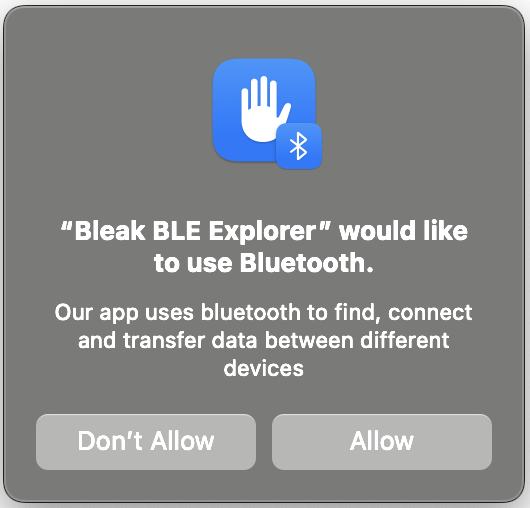

macOS backend
=============

The macOS backend of Bleak is written with
`pyobjc <https://pyobjc.readthedocs.io/en/latest/>`_ directives for interfacing
with `Foundation <https://pyobjc.readthedocs.io/en/latest/apinotes/Foundation.html>`_
and `CoreBluetooth <https://pyobjc.readthedocs.io/en/latest/apinotes/CoreBluetooth.html>`_ APIs.

Specific features for the macOS backend
---------------------------------------

The most noticeable difference between the other
backends of bleak and this backend, is that CoreBluetooth doesn't scan for
other devices via Bluetooth address. Instead, UUIDs are utilized that are often
unique between the device that is scanning and the device that is being scanned.

In the example files, this is handled in this fashion:

.. code-block:: python

    mac_addr = (
        "24:71:89:cc:09:05"
        if platform.system() != "Darwin"
        else "243E23AE-4A99-406C-B317-18F1BD7B4CBE"
    )

As stated above, this will however only work the macOS machine that performed
the scan and thus cached the device as ``243E23AE-4A99-406C-B317-18F1BD7B4CBE``.

Pairing
^^^^^^^
There is no pairing functionality implemented in macOS right now, since it does not seem
to be any explicit pairing methods in CoreBluetooth.

Instead, macOS will prompt the user the first time a characteristic that requires
authorization/authentication is accessed. This means that a GATT read or write
operation could block for a long time waiting for the user to responsed. So
timeouts should be set accordingly.

Calling the :meth:`bleak.BleakClient.pair` method will raise a ``NotImplementedError``
on macOS. But setting ``pair=True`` in :class:`bleak.BleakClient` will be silently ignored.

.. _cb-permissions:

Permissions
^^^^^^^^^^^
To use bluetooth in an bundled application you have to make sure, that `NSBluetoothAlwaysUsageDescription <https://developer.apple.com/documentation/BundleResources/Information-Property-List/NSBluetoothAlwaysUsageDescription>`_
is set in your ``Info.plist``. For example this has to look like:

.. code-block::

    <key>NSBluetoothAlwaysUsageDescription</key>
    <string>Some description why your app needs bluetooth access</string>

When using `briefcase <https://briefcase.readthedocs.io/en/stable/>`_ to package your application, 
you have to add the following to your ``pyproject.toml`` to create that entry in the ``Info.plist``:

.. code-block::

    [tool.briefcase.app.YOUR_APP_NAME.macOS]
    info."NSBluetoothAlwaysUsageDescription" = "Some description why your app needs bluetooth access"

In addition to this, the user has to grant the Bluetooth permission to the application. When
the application currently has no permission the OS will automatically create a popup window and
ask the user for permission. This happens when Bluetooth is used by the application for the
first time.

When the users allow the the bluetooth access, all ``bleak`` features can be used normally.

If the user doesn't allow it, a :class:`BleakBluetoothPermissionError` will raised every time
Bluetooth is accessed. An re-request of the bluetooth permissions is not possible programmatically.
This is only possible via the macOS system settings. To create a nice user experience the application
can catch the :class:`BleakBluetoothPermissionError` and guide the user to ``System Settings → Privacy & Security → 
Bluetooth``.

.. _cb-notification-discriminator:

Notifications
^^^^^^^^^^^^^
CoreBluetooth does not differentiate between data from a notification and data from a read.
This can cause confusion in cases where a device may send a notification message on a characteristic
as a signal that the characteristic needs to be read again.

Bleak can accept a ``notification_discriminator`` callback in the ``cb`` dict parameter that is
passed to the :meth:`bleak.BleakClient.start_notify` method that can differentiate between these types of data.

.. code-block:: python

    event = asyncio.Event()

    async def notification_handler(char, data):
        event.set()

    def notification_check_handler(data):
        # We can identify notifications on this characteristic because they
        # only contain 1 byte of data. Read responses will have more than
        # 1 byte.
        return len(data) == 1

    await client.start_notify(
        char,
        notification_handler,
        cb={"notification_discriminator": notification_check_handler},
    )

    while True:
        await event.wait()
        # We received a notification - prepare to receive another
        event.clear()
        # Then read the characteristic to get the full value
        data = await client.read_gatt_char(char)
        # Do stuff with data

API
---

Scanner
^^^^^^^

.. automodule:: bleak.backends.corebluetooth.scanner
    :members:

Client
^^^^^^

.. automodule:: bleak.backends.corebluetooth.client
    :members:
