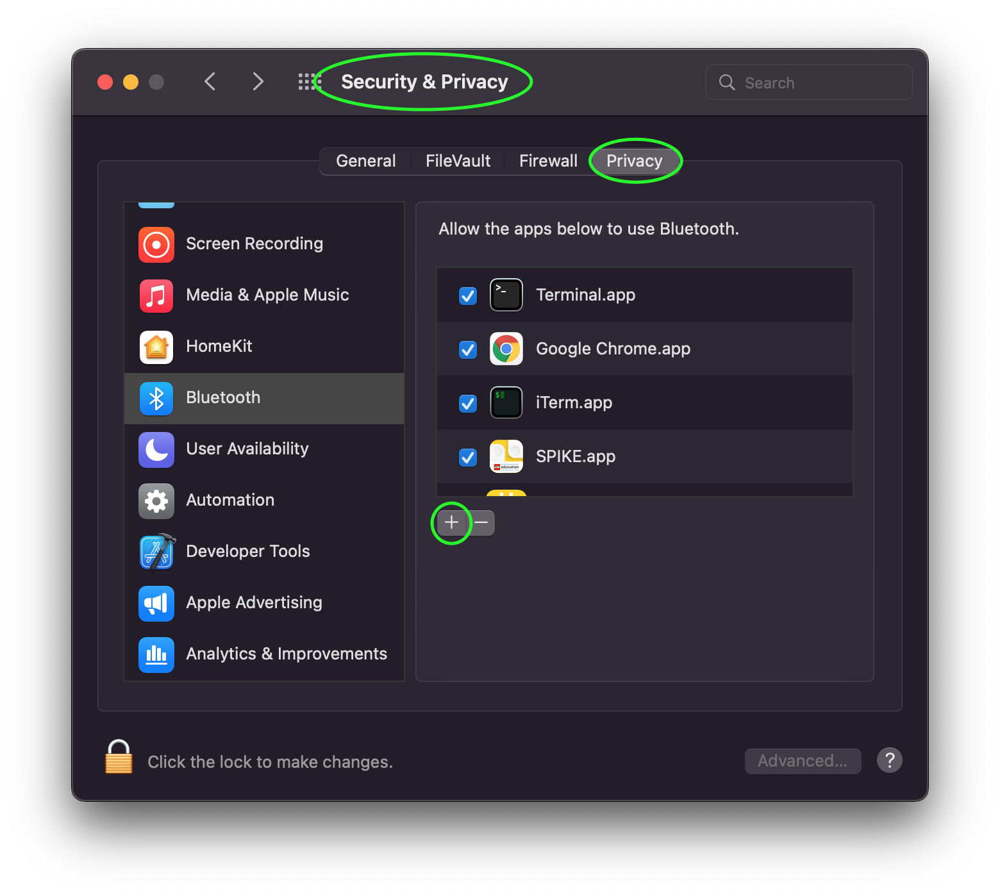

===============
Troubleshooting
===============

When things don't seem to be working right, here are some things to try.

---------------
Common Mistakes
---------------

Calling ``asyncio.run()`` more than once
========================================

Bleak requires the same asyncio run loop to be used for all of its operations.
And it requires the loop to always be running because there are background tasks
that need to always be running. Therefore, make sure you only call ``asyncio.run()``
once at the start of your program. **Your program will not work correctly if you
call it more than once.** Even if it seems like it is working, crashes and other
problems will occur eventually.

DON'T!

.. code-block:: python

    async def scan():
        return await BleakScanner.find_device_by_name("My Device")

    async def connect(device):
        async with BleakClient(device) as client:
            data = await client.read_gatt_char(MY_CHAR_UUID)
            print("received:" data)

    # Do not wrap each function call in asyncio.run() like this!
    device = asyncio.run(scan())
    if not device:
        print("Device not found")
    else:
        asyncio.run(connect(device))

DO!

.. code-block:: python

    async def scan():
        return await BleakScanner.find_device_by_name("My Device")

    async def connect(device):
        async with BleakClient(device) as client:
            data = await client.read_gatt_char(MY_CHAR_UUID)
            print("received:" data)

    # Do have one async main function that does everything.
    async def main():
        device = await scan()
        if not device:
            print("Device not found")
            return

        await connect(device)

    asyncio.run(main())

DON'T!

.. code-block:: python

    async def scan_and_connect():
        device = await BleakScanner.find_device_by_name("My Device")
        if not device:
            print("Device not found")
            return

        async with BleakClient(device) as client:
            data = await client.read_gatt_char(MY_CHAR_UUID)
            print("received:" data)

    while True:
        # Don't call asyncio.run() multiple times like this!
        asyncio.run(scan_and_connect())
        # Never use blocking sleep in an asyncio programs!
        time.sleep(5)

DO!

.. code-block:: python

    async def scan_and_connect():
        device = await BleakScanner.find_device_by_name("My Device")
        if not device:
            print("Device not found")
            return

        async with BleakClient(device) as client:
            data = await client.read_gatt_char(MY_CHAR_UUID)
            print("received:" data)

    # Do have one async main function that does everything.
    async def main():
        while True:
            await scan_and_connect()
            # Do use asyncio.sleep() in an asyncio program.
            await asyncio.sleep(5)

    asyncio.run(main())

Naming your script ``bleak.py``
===============================

Many people name their first script ``bleak.py``. This causes the script to
crash with an ``ImportError`` similar to::

    ImportError: cannot import name 'BleakClient' from partially initialized module 'bleak' (most likely due to a circular import) (bleak.py)`

To fix the error, change the name of the script to something other than ``bleak.py``.

----------
macOS Bugs
----------

Bleak crashes with SIGABRT on macOS
===================================

If you see a crash similar to this::

    Crashed Thread:        1  Dispatch queue: com.apple.root.default-qos

    Exception Type:        EXC_CRASH (SIGABRT)
    Exception Codes:       0x0000000000000000, 0x0000000000000000
    Exception Note:        EXC_CORPSE_NOTIFY

    Termination Reason:    Namespace TCC, Code 0
    This app has crashed because it attempted to access privacy-sensitive data without a usage description. The app's Info.plist must contain an NSBluetoothAlwaysUsageDescription key with a string value explaining to the user how the app uses this data.

It is not a problem with Bleak. It is a problem with your terminal application.

Ideally, the terminal application should be fixed by adding ``NSBluetoothAlwaysUsageDescription``
to the ``Info.plist`` file (`example <https://github.com/gnachman/iTerm2/pull/457/commits/626068e026ffb958242034129a1974ff87b21a32>`_).

It is also possible to manually add the app to the list of Bluetooth apps in
the *Privacy* settings in the macOS *System Preferences*.

If the app is already in the list but the checkbox for Bluetooth is disabled,
you will get the a ``BleakError``: "BLE is not authorized - check macOS privacy settings".
instead of crashing with ``SIGABRT``, in which case you need to check the box
to allow Bluetooth for the app that is running Python.

No devices found when scanning on macOS 12
==========================================

A bug was introduced in macOS 12.0 that causes scanning to not work unless a
list of service UUIDs is provided to ``BleakScanner``. This bug was fixed in
macOS 12.3. On the affected version, users of bleak will see the following
error logged:

.. code-block:: none

    macOS 12.0, 12.1 and 12.2 require non-empty service_uuids kwarg, otherwise no advertisement data will be received

See `#635 <https://github.com/hbldh/bleak/issues/635>`_ and
`#720 <https://github.com/hbldh/bleak/issues/720>`_ for more information
including some partial workarounds if you need to support these macOS versions.

------------
Windows Bugs
------------

Not working when threading model is STA
=======================================

Packages like ``pywin32`` and it's subsidiaries have an unfortunate side effect
of initializing the threading model to Single Threaded Apartment (STA) when
imported. This causes async WinRT functions to never complete if Bleak is being
used in a console application (no Windows graphical user interface). This is
because there isn't a Windows message loop running to handle async callbacks.
Bleak, when used in a console application, needs to run in a Multi Threaded
Apartment (MTA) instead (this happens automatically on the first WinRT call).

Bleak should detect this and raise an exception with a message similar to::

    Thread is configured for Windows GUI but callbacks are not working.

You can tell a ``pywin32`` package caused the issue by checking for
``"pythoncom" in sys.modules``. If it is there, then likely it triggered the
problem. You can avoid this by setting ``sys.coinit_flags = 0`` before importing
any package that indirectly imports ``pythoncom``. This will cause ``pythoncom``
to use the default threading model (MTA) instead of STA.

Example::

    import sys
    sys.coinit_flags = 0  # 0 means MTA

    import win32com  # or any other package that causes the issue

If the issue was caused by something other than the ``pythoncom`` module, there
are a couple of other helper functions you can try.

If your program has a graphical user interface and the UI framework *and* it is
properly integrated with asyncio *and* Bleak is not running on a background
thread then call ``allow_sta()`` before calling any other Bleak APis::

    try:
        from bleak.backends.winrt.util import allow_sta
        # tell Bleak we are using a graphical user interface that has been properly
        # configured to work with asyncio
        allow_sta()
    except ImportError:
        # other OSes and older versions of Bleak will raise ImportError which we
        # can safely ignore
        pass

The more typical case, though, is that some library has imported something similar
to ``pythoncom`` with the same unwanted side effect of initializing the main
thread of a console application to STA. In this case, you can uninitialize the
threading model like this::

    import naughty_module  # this sets current thread to STA :-(

    try:
        from bleak.backends.winrt.util import uninitialize_sta

        uninitialize_sta()  # undo the unwanted side effect
    except ImportError:
        # not Windows, so no problem
        pass

--------------
Enable Logging
--------------

The easiest way to enable logging is to set the ``BLEAK_LOGGING`` environment variable.
Setting the variable depends on what type of terminal you are using.

Posix (Linux, macOS, Cygwin, etc.)::

    export BLEAK_LOGGING=1

Power Shell::

    $env:BLEAK_LOGGING=1

Windows Command Prompt::

    set BLEAK_LOGGING=1

Then run your Python script in the same terminal.

-----------------------------------------------
Connecting to multiple devices at the same time
-----------------------------------------------

If you're having difficulty connecting to multiple devices, try to do a scan first and
pass the returned ``BLEDevice`` objects to ``BleakClient`` calls.

Python::

    import asyncio
    from typing import Sequence

    from bleak import BleakClient, BleakScanner
    from bleak.backends.device import BLEDevice

    async def find_all_devices_services():
        devices: Sequence[BLEDevice] = await BleakScanner.discover(timeout=5.0)

        for d in devices:
            async with BleakClient(d) as client:
                print(client.services)

    asyncio.run(find_all_devices_services())

-------------------------
Capture Bluetooth Traffic
-------------------------

Sometimes it can be helpful to see what is actually going over the air between
the OS and the Bluetooth device. There are tools available to capture HCI packets
and decode them.

Windows 10
==========

There is a Windows hardware developer package that includes a tool that supports
capturing Bluetooth traffic directly in Wireshark.

Install
-------

1. Download and install `Wireshark`_.
2. Download and install `the BTP software package`_.

Capture
-------

To capture Bluetooth traffic:

1.  Open a terminal as Administrator.

    * Search start menu for ``cmd``. (Powershell and Windows Terminal are fine too.)
    * Right-click *Command Prompt* and select *Run as Administrator*.

      .. image:: images/win-10-start-cmd-as-admin.png
        :height: 200px
        :alt: Screenshot of Windows Start Menu showing Command Prompt selected
              and context menu with Run as Administrator selected.

2.  Run ``C:\BTP\v1.9.0\x86\btvs.exe``. This should automatically start Wireshark
    in capture mode.

    .. tip:: The version needs to match the installed version. ``v1.9.0`` was
             the current version at the time this was written. Additionally,
             ``C:`` may not be the root drive on some systems.

3.  Run your Python script in a different terminal (not as Administrator) to reproduce
    the problem.

4.  Click the stop button in Wireshark to stop the capture.

.. _Wireshark:  https://www.wireshark.org/
.. _the BTP software package: https://docs.microsoft.com/windows-hardware/drivers/bluetooth/testing-btp-setup-package

macOS
=====

On macOS, special software is required to capture and view Bluetooth traffic.
You will need to sign up for an Apple Developer account to obtain this software.

1.  Go to `<https://developer.apple.com/download/more/>`_ and download *Additional
    Tools for Xcode ...* where ... is the Xcode version corresponding to your macOS
    version (e.g. 12 for Big Sur, 11 for Mojave, etc.).

2.  Open the disk image and in the *Hardware* folder, double-click the *PacketLogger.app*
    to run it.

3.  Click the *Clear* button in the toolbar to clear the old data.

4.  Run your Python script to reproduce the problem.

5.  Click the *Stop* button in the toolbar to stop the capture.

.. tip:: The Bluetooth traffic can be viewed in the *PacketLogger.app* or it can
         be saved to a file and viewed in `Wireshark`_.

Linux
=====

On Linux, `Wireshark`_ can be used to capture and view Bluetooth traffic.

1.  Install Wireshark. Most distributions include a ``wireshark`` package. For
    example, on Debian/Ubuntu based distributions::

        sudo apt update && sudo apt install wireshark

2.  Start Wireshark and select your Bluetooth adapter, then start a capture.

    .. tip:: Visit the `Wireshark Wiki`_ for help with configuring permissions
             and making sure proper drivers are installed.

3.  Run your Python script to reproduce the problem.

4.  Click the stop button in Wireshark to stop the capture.

.. _Wireshark Wiki: https://gitlab.com/wireshark/wireshark/-/wikis/CaptureSetup

------------------------------------------
Handling OS Caching of BLE Device Services
------------------------------------------

If you develop your own BLE peripherals, and frequently change services, characteristics and/or descriptors, then
Bleak might report outdated versions of your peripheral's services due to OS level caching. The caching is done to
speed up the connections with peripherals where services do not change and is enabled by default on most operating
systems and thus also in Bleak.

There are ways to avoid this on different backends though, and if you experience these kinds of problems, the steps
below might help you to circumvent the caches.

macOS
=====

The OS level caching handling on macOS has not been explored yet.

Linux
=====

When you change the structure of services/characteristics on a device, you have to remove the device from
BlueZ so that it will read everything again. Otherwise BlueZ gives the cached values from the first time
the device was connected. You can use the ``bluetoothctl`` command line tool to do this:

.. code-block:: shell

    bluetoothctl -- remove XX:XX:XX:XX:XX:XX
    # prior to BlueZ 5.62 you also need to manually delete the GATT cache
    sudo rm "/var/lib/bluetooth/YY:YY:YY:YY:YY:YY/cache/XX:XX:XX:XX:XX:XX"

...where ``XX:XX:XX:XX:XX:XX`` is the Bluetooth address of your device and
``YY:YY:YY:YY:YY:YY`` is the Bluetooth address of the Bluetooth adapter on
your computer.
